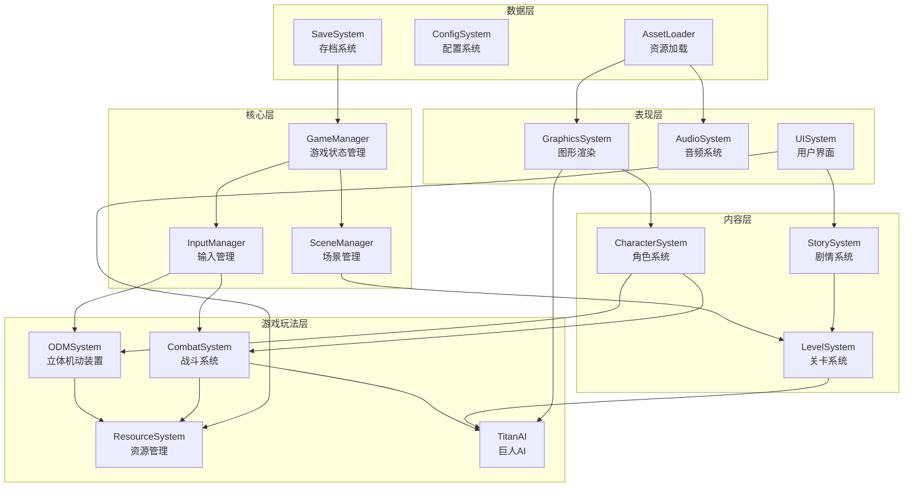

# Design Document: Attack on Titan Fan Game

## Overview

本设计文档描述一款基于《进击的巨人》的第三人称动作同人游戏的技术架构和实现方案。游戏使用Python + Ursina Engine开发，实现立体机动装置(ODM Gear)核心玩法，支持104期训练兵团角色选择，涵盖动漫第一至第三季剧情。

### 技术栈选择
- **游戏引擎**: Ursina Engine (基于Panda3D的Python游戏引擎)
- **编程语言**: Python 3.10+
- **3D渲染**: Panda3D (Ursina底层)
- **物理引擎**: 自定义物理系统 + Ursina内置碰撞检测
- **打包工具**: PyInstaller (生成exe)
- **音频**: Ursina Audio模块

### 为什么选择Ursina Engine
1. 纯Python开发，学习曲线平缓
2. 内置3D渲染、碰撞检测、输入处理
3. 支持自定义着色器(实现卡通渲染)
4. 易于打包为独立可执行文件
5. 活跃的社区和文档支持

## Architecture

### 系统架构图



### 目录结构

```
Fanren-Attack on Titan/
├── main.py                 # 游戏入口
├── config.py               # 全局配置
├── requirements.txt        # Python依赖
├── build.spec              # PyInstaller配置
│
├── core/                   # 核心系统
│   ├── __init__.py
│   ├── game_manager.py     # 游戏状态管理
│   ├── scene_manager.py    # 场景切换
│   └── input_manager.py    # 输入处理
│
├── gameplay/               # 游戏玩法
│   ├── __init__.py
│   ├── odm_system.py       # 立体机动装置
│   ├── combat_system.py    # 战斗系统
│   ├── resource_system.py  # 资源管理
│   └── titan_ai.py         # 巨人AI
│
├── content/                # 内容系统
│   ├── __init__.py
│   ├── character.py        # 角色定义
│   ├── story_system.py     # 剧情系统
│   └── level_system.py     # 关卡系统
│
├── presentation/           # 表现层
│   ├── __init__.py
│   ├── graphics.py         # 图形渲染
│   ├── audio.py            # 音频系统
│   └── ui/                 # UI组件
│       ├── __init__.py
│       ├── hud.py          # 游戏HUD
│       ├── menu.py         # 菜单界面
│       └── dialogue.py     # 对话框
│
├── data/                   # 数据层
│   ├── __init__.py
│   ├── save_system.py      # 存档系统
│   └── asset_loader.py     # 资源加载
│
├── assets/                 # 游戏资源
│   ├── models/             # 3D模型
│   ├── textures/           # 贴图
│   ├── sounds/             # 音效
│   ├── music/              # 背景音乐
│   └── shaders/            # 着色器
│
└── data_files/             # 数据文件
    ├── characters.json     # 角色数据
    ├── stories.json        # 剧情数据
    ├── levels.json         # 关卡数据
    └── titans.json         # 巨人数据
```

## Components and Interfaces

### 1. GameManager (游戏管理器)

```python
class GameState(Enum):
    MAIN_MENU = "main_menu"
    CHARACTER_SELECT = "character_select"
    GAMEPLAY = "gameplay"
    CUTSCENE = "cutscene"
    PAUSED = "paused"
    GAME_OVER = "game_over"
    RESULTS = "results"

class GameManager:
    """游戏全局状态管理"""
    
    def __init__(self):
        self.current_state: GameState
        self.selected_character: Character
        self.current_chapter: int
        self.score: int
    
    def change_state(self, new_state: GameState) -> None: ...
    def start_new_game(self, character_id: str) -> None: ...
    def load_game(self, save_slot: int) -> None: ...
    def save_game(self, save_slot: int) -> None: ...
    def pause_game(self) -> None: ...
    def resume_game(self) -> None: ...
```

### 2. ODMSystem (立体机动装置系统)

```python
@dataclass
class HookState:
    is_attached: bool
    attach_point: Vec3
    rope_length: float
    tension: float

class ODMSystem:
    """立体机动装置核心逻辑"""
    
    def __init__(self, player: Entity):
        self.player: Entity
        self.left_hook: HookState
        self.right_hook: HookState
        self.velocity: Vec3
        self.gas_level: float
        self.max_gas: float
        self.hook_range: float
        self.boost_power: float
    
    def fire_hook(self, direction: Vec3, hook_side: str) -> bool: ...
    def release_hook(self, hook_side: str) -> None: ...
    def update_swing_physics(self, dt: float) -> None: ...
    def activate_boost(self) -> bool: ...
    def get_momentum(self) -> Vec3: ...
    def consume_gas(self, amount: float) -> bool: ...
    def refill_gas(self) -> None: ...
```

### 3. CombatSystem (战斗系统)

```python
@dataclass
class AttackResult:
    hit: bool
    damage: float
    is_critical: bool
    target_part: str
    killed: bool

class CombatSystem:
    """战斗逻辑处理"""
    
    def __init__(self, player: Entity):
        self.player: Entity
        self.blade_durability: float
        self.blade_count: int
        self.combo_count: int
        self.combo_timer: float
        self.attack_power: float
    
    def perform_slash(self, target: Entity, hit_point: Vec3) -> AttackResult: ...
    def check_nape_hit(self, titan: Entity, hit_point: Vec3) -> bool: ...
    def update_combo(self, dt: float) -> None: ...
    def switch_blade(self) -> bool: ...
    def calculate_damage(self, is_nape: bool, speed: float) -> float: ...
    def get_score_multiplier(self) -> float: ...
```

### 4. TitanAI (巨人AI系统)

```python
class TitanType(Enum):
    NORMAL = "normal"
    ABNORMAL = "abnormal"
    SPECIAL = "special"

class TitanState(Enum):
    IDLE = "idle"
    WANDERING = "wandering"
    PURSUING = "pursuing"
    ATTACKING = "attacking"
    GRABBING = "grabbing"
    STUNNED = "stunned"
    DYING = "dying"

class TitanAI:
    """巨人行为控制"""
    
    def __init__(self, titan_type: TitanType):
        self.titan_type: TitanType
        self.current_state: TitanState
        self.target: Entity
        self.detection_range: float
        self.attack_range: float
        self.health: float
        self.nape_hitbox: Entity
    
    def update(self, dt: float, player: Entity) -> None: ...
    def detect_player(self, player: Entity) -> bool: ...
    def pursue_target(self) -> None: ...
    def perform_attack(self) -> None: ...
    def perform_grab(self) -> None: ...
    def take_damage(self, damage: float, hit_nape: bool) -> bool: ...
    def die(self) -> None: ...
```

### 5. Character (角色系统)

```python
@dataclass
class CharacterStats:
    speed: float          # 移动速度修正
    attack_power: float   # 攻击力修正
    stamina: float        # 体力值
    gas_efficiency: float # 气体消耗效率

class Character:
    """可玩角色定义"""
    
    def __init__(self, character_id: str):
        self.id: str
        self.name: str
        self.portrait: str
        self.model_path: str
        self.stats: CharacterStats
        self.background: str
        self.personality_traits: List[str]
        self.relationships: Dict[str, str]
    
    @staticmethod
    def load_from_json(character_id: str) -> 'Character': ...
    def get_dialogue_variant(self, dialogue_id: str) -> str: ...
    def get_reaction(self, event_id: str) -> str: ...
```

### 6. StorySystem (剧情系统)

```python
@dataclass
class StoryChapter:
    id: str
    title: str
    season: int
    description: str
    missions: List[str]
    cutscenes: List[str]
    unlock_condition: str

class StorySystem:
    """剧情流程管理"""
    
    def __init__(self):
        self.chapters: List[StoryChapter]
        self.current_chapter: int
        self.unlocked_chapters: Set[int]
        self.character_dialogues: Dict[str, Dict]
    
    def load_chapter(self, chapter_id: str) -> StoryChapter: ...
    def unlock_next_chapter(self) -> None: ...
    def get_cutscene(self, cutscene_id: str, character: Character) -> List[Dict]: ...
    def get_character_perspective(self, event_id: str, character: Character) -> str: ...
    def is_chapter_unlocked(self, chapter_id: str) -> bool: ...
```

### 7. LevelSystem (关卡系统)

```python
@dataclass
class SpawnPoint:
    position: Vec3
    titan_type: TitanType
    spawn_delay: float

@dataclass
class LevelData:
    id: str
    name: str
    environment: str
    spawn_points: List[SpawnPoint]
    objectives: List[str]
    time_limit: float

class LevelSystem:
    """关卡加载与管理"""
    
    def __init__(self):
        self.current_level: LevelData
        self.active_titans: List[Entity]
        self.objectives_completed: Set[str]
        self.elapsed_time: float
    
    def load_level(self, level_id: str) -> None: ...
    def spawn_titan(self, spawn_point: SpawnPoint) -> Entity: ...
    def check_objectives(self) -> bool: ...
    def complete_level(self) -> Dict: ...
    def fail_level(self, reason: str) -> None: ...
```

### 8. SaveSystem (存档系统)

```python
@dataclass
class SaveData:
    version: str
    character_id: str
    current_chapter: int
    unlocked_chapters: List[int]
    total_score: int
    play_time: float
    settings: Dict
    timestamp: str

class SaveSystem:
    """游戏存档管理"""
    
    SAVE_DIR = "saves/"
    
    def __init__(self):
        self.save_slots: Dict[int, SaveData]
    
    def save_game(self, slot: int, game_state: Dict) -> bool: ...
    def load_game(self, slot: int) -> SaveData: ...
    def delete_save(self, slot: int) -> bool: ...
    def get_save_info(self, slot: int) -> Dict: ...
    def serialize_to_json(self, save_data: SaveData) -> str: ...
    def deserialize_from_json(self, json_str: str) -> SaveData: ...
```

## Data Models

### 角色数据 (characters.json)

```json
{
  "eren": {
    "id": "eren",
    "name": "艾伦·耶格尔",
    "name_en": "Eren Yeager",
    "portrait": "assets/portraits/eren.png",
    "model": "assets/models/eren.glb",
    "stats": {
      "speed": 1.0,
      "attack_power": 1.2,
      "stamina": 100,
      "gas_efficiency": 1.0
    },
    "background": "希干希纳区出身，目睹母亲被巨人吞噬后立志消灭所有巨人",
    "personality": ["热血", "执着", "冲动"],
    "relationships": {
      "mikasa": "青梅竹马",
      "armin": "挚友"
    }
  }
}
```

### 剧情数据 (stories.json)

```json
{
  "chapters": [
    {
      "id": "s1_c1",
      "title": "那一天",
      "season": 1,
      "description": "超大型巨人突然出现，希干希纳区陷落",
      "missions": ["trost_defense_1"],
      "cutscenes": ["intro_wall_breach"],
      "unlock_condition": "start"
    }
  ],
  "dialogues": {
    "intro_wall_breach": {
      "eren": ["那一天，人类终于回想起了...被巨人支配的恐惧"],
      "mikasa": ["艾伦...我们必须活下去"],
      "armin": ["墙...墙被打破了！"]
    }
  }
}
```

### 巨人数据 (titans.json)

```json
{
  "titan_types": {
    "normal_3m": {
      "type": "normal",
      "height": 3,
      "health": 100,
      "speed": 2.0,
      "detection_range": 30,
      "attack_damage": 20,
      "model": "assets/models/titan_3m.glb"
    },
    "abnormal_7m": {
      "type": "abnormal",
      "height": 7,
      "health": 200,
      "speed": 5.0,
      "detection_range": 50,
      "attack_damage": 40,
      "behavior": "erratic",
      "model": "assets/models/titan_7m.glb"
    }
  }
}
```

### 关卡数据 (levels.json)

```json
{
  "levels": {
    "trost_defense_1": {
      "id": "trost_defense_1",
      "name": "托洛斯特区防卫战",
      "environment": "trost_city",
      "spawn_points": [
        {"position": [100, 0, 50], "titan_type": "normal_3m", "delay": 0},
        {"position": [150, 0, 80], "titan_type": "normal_5m", "delay": 5}
      ],
      "objectives": [
        {"type": "kill", "target": "titan", "count": 10},
        {"type": "survive", "time": 300}
      ],
      "time_limit": 600
    }
  }
}
```


## Correctness Properties

*A property is a characteristic or behavior that should hold true across all valid executions of a system-essentially, a formal statement about what the system should do. Properties serve as the bridge between human-readable specifications and machine-verifiable correctness guarantees.*

Based on the acceptance criteria analysis, the following correctness properties must be validated through property-based testing:

### Character System Properties

**Property 1: Character stats application consistency**
*For any* valid character ID, when that character is selected, the player entity's speed, attack_power, stamina, and gas_efficiency values SHALL equal the character's defined stats.
**Validates: Requirements 1.2, 1.4**

**Property 2: Character info completeness**
*For any* character in the character database, the rendered character info display SHALL contain non-empty values for name, portrait path, all stat fields, and background description.
**Validates: Requirements 1.3**

### ODM System Properties

**Property 3: Hook attachment validity**
*For any* hook firing action toward a valid surface within hook_range, the hook SHALL transition to attached state with attach_point on that surface.
**Validates: Requirements 2.1**

**Property 4: Momentum preservation on hook release**
*For any* attached hook state with non-zero velocity, releasing the hook SHALL preserve the velocity vector magnitude within 5% tolerance.
**Validates: Requirements 2.6**

**Property 5: Gas consumption on boost**
*For any* player state with gas_level > 0, activating propulsion boost SHALL decrease gas_level by boost_cost AND increase velocity magnitude.
**Validates: Requirements 2.3**

**Property 6: Gas depletion disables boost**
*For any* player state with gas_level = 0, attempting to activate propulsion boost SHALL fail and return False.
**Validates: Requirements 2.5**

### Combat System Properties

**Property 7: Nape hit causes kill**
*For any* slash attack where hit_point is within the titan's nape_hitbox, the attack result SHALL have killed=True and is_critical=True.
**Validates: Requirements 3.1**

**Property 8: Non-nape hit preserves titan life**
*For any* slash attack where hit_point is NOT within the titan's nape_hitbox and titan health > attack damage, the attack result SHALL have killed=False.
**Validates: Requirements 3.2**

**Property 9: Combo counter increments on consecutive kills**
*For any* sequence of N successful nape attacks without combo timeout, combo_count SHALL equal N.
**Validates: Requirements 3.3**

**Property 10: Blade durability decreases on attack**
*For any* slash attack performed, blade_durability after attack SHALL be less than blade_durability before attack by exactly durability_cost.
**Validates: Requirements 3.4**

**Property 11: Zero durability disables attack**
*For any* combat state with blade_durability = 0, attempting perform_slash SHALL fail until switch_blade is called.
**Validates: Requirements 3.5**

**Property 12: Kill score calculation**
*For any* titan kill with combo_count C and style_multiplier S, awarded score SHALL equal base_score * C * S.
**Validates: Requirements 3.6**

### Resource System Properties

**Property 13: Low gas warning threshold**
*For any* gas_level < max_gas * 0.2, the HUD low_gas_warning indicator SHALL be visible.
**Validates: Requirements 4.2**

**Property 14: Low blade warning threshold**
*For any* blade_count < 2, the HUD low_blade_warning indicator SHALL be visible.
**Validates: Requirements 4.3**

**Property 15: Supply station refill**
*For any* resource state, interacting with a supply station SHALL set gas_level = max_gas AND blade_count = max_blades.
**Validates: Requirements 4.4**

**Property 16: Blade switch restores durability**
*For any* state with blade_count > 0, calling switch_blade SHALL set blade_durability = max_durability AND decrement blade_count by 1.
**Validates: Requirements 4.5**

### Titan AI Properties

**Property 17: Titan type determines behavior pattern**
*For any* spawned titan with TitanType T, the assigned behavior_pattern SHALL match the pattern defined for type T in titan configuration.
**Validates: Requirements 5.1**

**Property 18: Detection triggers pursuit**
*For any* titan and player where distance(titan, player) < titan.detection_range, titan.current_state SHALL transition to PURSUING.
**Validates: Requirements 5.2**

**Property 19: Attack triggers response**
*For any* attack on a titan, titan.current_state SHALL transition to either ATTACKING or defensive state within response_time.
**Validates: Requirements 5.3**

### Story System Properties

**Property 20: Mission completion unlocks next chapter**
*For any* completed mission that is the final mission of chapter N, chapter N+1 SHALL be added to unlocked_chapters.
**Validates: Requirements 6.1**

**Property 21: Character-specific dialogue**
*For any* cutscene and character combination, get_cutscene(cutscene_id, character) SHALL return dialogue entries that differ from other characters' dialogue for the same cutscene.
**Validates: Requirements 6.2**

**Property 22: Character reaction consistency**
*For any* story event and character, get_reaction(event_id) SHALL return a reaction string that matches the character's personality_traits and relationships.
**Validates: Requirements 6.5**

### Level System Properties

**Property 23: Level environment loading**
*For any* level_id in level configuration, load_level(level_id) SHALL create an environment matching the specified environment type.
**Validates: Requirements 7.1**

**Property 24: Titan spawn accuracy**
*For any* level with spawn_points list, after level load, active_titans positions SHALL match spawn_point positions within tolerance.
**Validates: Requirements 7.2**

**Property 25: Objective completion triggers results**
*For any* level where all objectives in objectives list are completed, check_objectives() SHALL return True and trigger results screen.
**Validates: Requirements 7.4**

### Save System Properties

**Property 26: Save/Load round-trip**
*For any* valid game state G, save_game(slot, G) followed by load_game(slot) SHALL return a state equivalent to G.
**Validates: Requirements 10.1, 10.2**

**Property 27: JSON serialization round-trip**
*For any* valid SaveData object S, deserialize_from_json(serialize_to_json(S)) SHALL return an object equivalent to S.
**Validates: Requirements 10.5, 10.6**

### Control System Properties

**Property 28: Movement input mapping**
*For any* movement key press with direction D, player velocity component in direction D SHALL increase.
**Validates: Requirements 11.1**

**Property 29: Hook input triggers fire**
*For any* hook key press, ODMSystem.fire_hook SHALL be called with direction toward camera aim point.
**Validates: Requirements 11.2**

**Property 30: Attack input triggers slash**
*For any* attack key press with blade_durability > 0, CombatSystem.perform_slash SHALL be called.
**Validates: Requirements 11.3**

## Error Handling

### 输入验证错误

| 错误场景 | 处理方式 |
|---------|---------|
| 无效角色ID | 抛出 `CharacterNotFoundError`，返回角色选择界面 |
| 无效关卡ID | 抛出 `LevelNotFoundError`，显示错误提示 |
| 损坏的存档文件 | 抛出 `SaveCorruptedError`，提示用户删除或忽略 |

### 资源加载错误

| 错误场景 | 处理方式 |
|---------|---------|
| 模型文件缺失 | 使用占位模型，记录警告日志 |
| 音频文件缺失 | 静默处理，记录警告日志 |
| 贴图文件缺失 | 使用默认贴图，记录警告日志 |

### 运行时错误

| 错误场景 | 处理方式 |
|---------|---------|
| 物理计算异常 | 重置玩家位置到安全点 |
| AI状态机死锁 | 强制重置到IDLE状态 |
| 内存不足 | 显示警告，尝试释放缓存资源 |

### 错误恢复策略

```python
class GameError(Exception):
    """游戏错误基类"""
    pass

class CharacterNotFoundError(GameError):
    """角色未找到"""
    pass

class LevelNotFoundError(GameError):
    """关卡未找到"""
    pass

class SaveCorruptedError(GameError):
    """存档损坏"""
    pass

def safe_load_character(character_id: str) -> Character:
    """安全加载角色，失败时返回默认角色"""
    try:
        return Character.load_from_json(character_id)
    except CharacterNotFoundError:
        logger.warning(f"Character {character_id} not found, using default")
        return Character.load_from_json("eren")  # 默认角色
```

## Testing Strategy

### 测试框架选择

- **单元测试**: pytest
- **属性测试**: Hypothesis (Python PBT库)
- **集成测试**: pytest + Ursina测试模式

### 单元测试覆盖

1. **核心系统测试**
   - GameManager状态转换
   - InputManager按键映射
   - SceneManager场景切换

2. **游戏玩法测试**
   - ODMSystem物理计算
   - CombatSystem伤害计算
   - ResourceSystem资源消耗
   - TitanAI状态机转换

3. **数据系统测试**
   - SaveSystem序列化/反序列化
   - Character数据加载
   - Level数据解析

### 属性测试策略

使用Hypothesis库实现属性测试，每个属性测试运行最少100次迭代。

**测试标注格式**: `**Feature: aot-fan-game, Property {number}: {property_text}**`

**关键属性测试**:

1. **Save/Load Round-trip (Property 26, 27)**
   - 生成随机游戏状态
   - 序列化后反序列化
   - 验证状态等价性

2. **Combat Damage Calculation (Property 7, 8, 10, 12)**
   - 生成随机攻击参数
   - 验证伤害计算正确性
   - 验证连击计数准确性

3. **Resource Management (Property 5, 6, 13-16)**
   - 生成随机资源状态
   - 验证消耗和补充逻辑
   - 验证警告阈值触发

4. **Titan AI State Transitions (Property 17-19)**
   - 生成随机玩家位置
   - 验证检测和追踪逻辑
   - 验证状态转换正确性

### 测试文件结构

```
tests/
├── __init__.py
├── conftest.py              # pytest配置和fixtures
├── test_game_manager.py     # GameManager单元测试
├── test_odm_system.py       # ODM系统测试
├── test_combat_system.py    # 战斗系统测试
├── test_resource_system.py  # 资源系统测试
├── test_titan_ai.py         # 巨人AI测试
├── test_save_system.py      # 存档系统测试
├── test_character.py        # 角色系统测试
├── test_story_system.py     # 剧情系统测试
├── test_level_system.py     # 关卡系统测试
└── properties/              # 属性测试
    ├── __init__.py
    ├── test_props_save.py   # 存档属性测试
    ├── test_props_combat.py # 战斗属性测试
    ├── test_props_odm.py    # ODM属性测试
    └── test_props_ai.py     # AI属性测试
```

### Hypothesis策略示例

```python
from hypothesis import given, strategies as st, settings

# 自定义策略：生成有效的游戏状态
@st.composite
def game_states(draw):
    return {
        'character_id': draw(st.sampled_from(['eren', 'mikasa', 'armin', 'levi'])),
        'current_chapter': draw(st.integers(min_value=1, max_value=20)),
        'score': draw(st.integers(min_value=0, max_value=1000000)),
        'gas_level': draw(st.floats(min_value=0, max_value=100)),
        'blade_count': draw(st.integers(min_value=0, max_value=8)),
    }

# Property 27: JSON序列化往返测试
@given(game_states())
@settings(max_examples=100)
def test_json_round_trip(state):
    """
    **Feature: aot-fan-game, Property 27: JSON serialization round-trip**
    """
    save_data = SaveData(**state)
    json_str = save_system.serialize_to_json(save_data)
    restored = save_system.deserialize_from_json(json_str)
    assert restored == save_data
```

