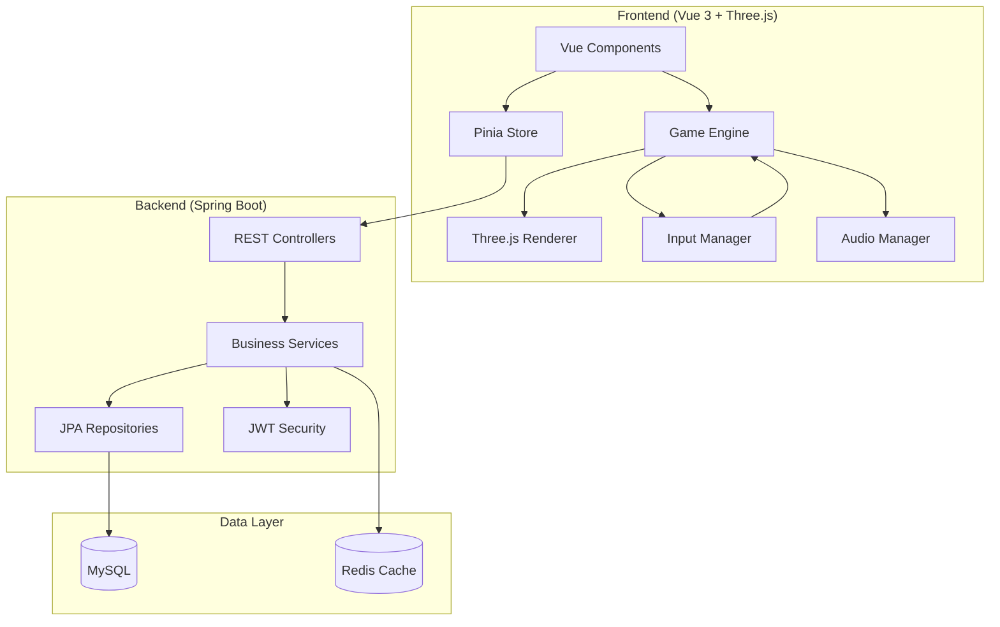
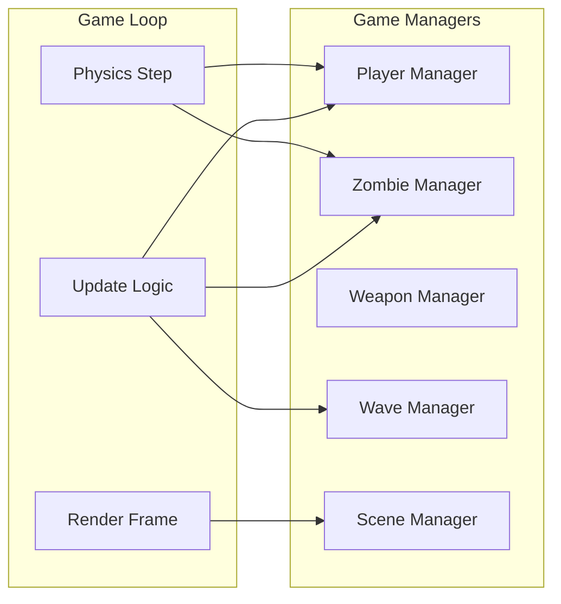
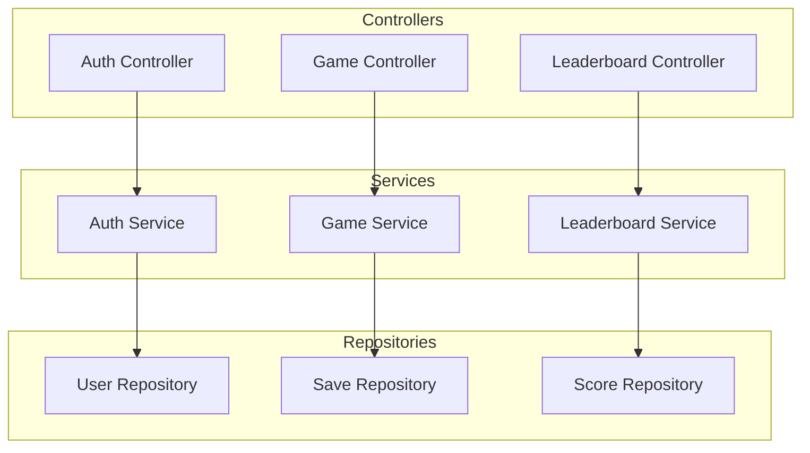

# Design Document: Zombie World War

## Overview

Zombie World War是一款基于Web的3D第一人称射击生存游戏。游戏设定在全球生化病毒爆发后的末日世界，玩家需要在废墟城市中使用各种武器射杀丧尸，尽可能存活更多波次。

### 技术栈
- **前端**: Vue 3 + TypeScript + Three.js + Vite
- **后端**: Spring Boot 3 + Java 17 + MySQL + Redis
- **3D引擎**: Three.js with custom game engine wrapper
- **状态管理**: Pinia
- **通信**: RESTful API + WebSocket (实时排行榜)

### 游戏背景设定
2027年，一种名为"Omega-7"的生化病毒从某秘密实验室泄露，迅速蔓延全球。感染者在48小时内变异为嗜血的丧尸，人类文明在数周内崩溃。玩家扮演一名幸存者，在废弃的城市中寻找物资、武装自己，抵御一波又一波的丧尸攻击。

## Architecture



### 前端架构



### 后端架构



## Components and Interfaces

### 前端核心组件

#### 1. GameEngine (游戏引擎核心)

```typescript
interface GameEngine {
  // 生命周期
  init(): Promise<void>;
  start(): void;
  pause(): void;
  resume(): void;
  stop(): void;
  
  // 游戏循环
  update(deltaTime: number): void;
  render(): void;
  
  // 状态管理
  getState(): GameState;
  setState(state: GameState): void;
  
  // 事件系统
  on(event: string, callback: Function): void;
  emit(event: string, data?: any): void;
}
```

#### 2. Player (玩家控制器)

```typescript
interface Player {
  // 属性
  position: Vector3;
  rotation: Euler;
  health: number;
  maxHealth: number;
  stamina: number;
  maxStamina: number;
  
  // 移动
  move(direction: Vector3): void;
  jump(): void;
  sprint(active: boolean): void;
  
  // 战斗
  getCurrentWeapon(): Weapon;
  switchWeapon(slot: number): void;
  fire(): void;
  reload(): void;
  
  // 状态
  takeDamage(amount: number): void;
  heal(amount: number): void;
  isDead(): boolean;
}
```

#### 3. Weapon (武器系统)

```typescript
interface Weapon {
  id: string;
  name: string;
  type: WeaponType;
  damage: number;
  fireRate: number;
  magazineSize: number;
  currentAmmo: number;
  reserveAmmo: number;
  reloadTime: number;
  range: number;
  
  fire(): boolean;
  reload(): Promise<void>;
  canFire(): boolean;
  canReload(): boolean;
}

enum WeaponType {
  PISTOL = 'pistol',
  RIFLE = 'rifle',
  SHOTGUN = 'shotgun',
  MELEE = 'melee'
}
```

#### 4. Zombie (丧尸AI)

```typescript
interface Zombie {
  id: string;
  position: Vector3;
  health: number;
  maxHealth: number;
  damage: number;
  speed: number;
  state: ZombieState;
  variant: ZombieVariant;
  
  update(deltaTime: number, playerPosition: Vector3): void;
  takeDamage(amount: number, hitPoint: Vector3): void;
  attack(): void;
  die(): void;
}

enum ZombieState {
  IDLE = 'idle',
  WANDERING = 'wandering',
  CHASING = 'chasing',
  ATTACKING = 'attacking',
  DYING = 'dying'
}

enum ZombieVariant {
  WALKER = 'walker',      // 普通行尸
  RUNNER = 'runner',      // 快速奔跑者
  BRUTE = 'brute',        // 重型坦克
  CRAWLER = 'crawler'     // 爬行者
}
```

#### 5. WaveManager (波次管理器)

```typescript
interface WaveManager {
  currentWave: number;
  zombiesRemaining: number;
  isPreparationPhase: boolean;
  preparationTimeLeft: number;
  
  startWave(): void;
  endWave(): void;
  spawnZombies(): void;
  onZombieKilled(): void;
  getWaveConfig(waveNumber: number): WaveConfig;
}

interface WaveConfig {
  totalZombies: number;
  zombieTypes: Map<ZombieVariant, number>;
  spawnInterval: number;
  difficultyMultiplier: number;
}
```

#### 6. SceneManager (场景管理器)

```typescript
interface SceneManager {
  currentScene: THREE.Scene;
  camera: THREE.PerspectiveCamera;
  renderer: THREE.WebGLRenderer;
  
  loadScene(sceneName: string): Promise<void>;
  addObject(object: THREE.Object3D): void;
  removeObject(object: THREE.Object3D): void;
  updateLighting(playerPosition: Vector3): void;
  checkCollision(ray: THREE.Raycaster): THREE.Intersection[];
}
```

### 后端核心接口

#### 1. AuthController

```java
@RestController
@RequestMapping("/api/auth")
public interface AuthController {
    @PostMapping("/register")
    ResponseEntity<AuthResponse> register(@RequestBody RegisterRequest request);
    
    @PostMapping("/login")
    ResponseEntity<AuthResponse> login(@RequestBody LoginRequest request);
    
    @PostMapping("/refresh")
    ResponseEntity<AuthResponse> refreshToken(@RequestHeader("Authorization") String token);
}
```

#### 2. GameController

```java
@RestController
@RequestMapping("/api/game")
public interface GameController {
    @PostMapping("/save")
    ResponseEntity<SaveResponse> saveGame(@RequestBody GameStateDTO gameState);
    
    @GetMapping("/load/{saveId}")
    ResponseEntity<GameStateDTO> loadGame(@PathVariable Long saveId);
    
    @GetMapping("/saves")
    ResponseEntity<List<SaveSummaryDTO>> listSaves();
    
    @DeleteMapping("/save/{saveId}")
    ResponseEntity<Void> deleteSave(@PathVariable Long saveId);
}
```

#### 3. LeaderboardController

```java
@RestController
@RequestMapping("/api/leaderboard")
public interface LeaderboardController {
    @PostMapping("/submit")
    ResponseEntity<ScoreResponse> submitScore(@RequestBody ScoreSubmitDTO score);
    
    @GetMapping("/top")
    ResponseEntity<Page<LeaderboardEntryDTO>> getTopScores(
        @RequestParam(defaultValue = "0") int page,
        @RequestParam(defaultValue = "20") int size
    );
    
    @GetMapping("/rank/{userId}")
    ResponseEntity<RankDTO> getUserRank(@PathVariable Long userId);
}
```

## Data Models

### 前端数据模型

```typescript
// 游戏状态
interface GameState {
  player: PlayerState;
  wave: WaveState;
  zombies: ZombieState[];
  score: number;
  playTime: number;
  timestamp: number;
}

interface PlayerState {
  position: { x: number; y: number; z: number };
  rotation: { x: number; y: number; z: number };
  health: number;
  stamina: number;
  weapons: WeaponState[];
  currentWeaponIndex: number;
}

interface WeaponState {
  id: string;
  currentAmmo: number;
  reserveAmmo: number;
}

interface WaveState {
  currentWave: number;
  zombiesKilled: number;
  totalZombiesInWave: number;
  isPreparationPhase: boolean;
}

// 向量类型
interface Vector3 {
  x: number;
  y: number;
  z: number;
}
```

### 后端数据模型

```java
// 用户实体
@Entity
@Table(name = "users")
public class User {
    @Id
    @GeneratedValue(strategy = GenerationType.IDENTITY)
    private Long id;
    
    @Column(unique = true, nullable = false)
    private String username;
    
    @Column(unique = true, nullable = false)
    private String email;
    
    @Column(nullable = false)
    private String passwordHash;
    
    private LocalDateTime createdAt;
    private LocalDateTime lastLoginAt;
}

// 游戏存档实体
@Entity
@Table(name = "game_saves")
public class GameSave {
    @Id
    @GeneratedValue(strategy = GenerationType.IDENTITY)
    private Long id;
    
    @ManyToOne
    @JoinColumn(name = "user_id", nullable = false)
    private User user;
    
    @Column(columnDefinition = "JSON")
    private String gameStateJson;
    
    private Integer waveReached;
    private Integer score;
    private LocalDateTime savedAt;
}

// 排行榜实体
@Entity
@Table(name = "leaderboard")
public class LeaderboardEntry {
    @Id
    @GeneratedValue(strategy = GenerationType.IDENTITY)
    private Long id;
    
    @ManyToOne
    @JoinColumn(name = "user_id", nullable = false)
    private User user;
    
    private Integer score;
    private Integer waveReached;
    private Integer zombiesKilled;
    private Long playTimeSeconds;
    private LocalDateTime achievedAt;
}
```

### 数据库Schema

```sql
CREATE TABLE users (
    id BIGINT PRIMARY KEY AUTO_INCREMENT,
    username VARCHAR(50) UNIQUE NOT NULL,
    email VARCHAR(100) UNIQUE NOT NULL,
    password_hash VARCHAR(255) NOT NULL,
    created_at TIMESTAMP DEFAULT CURRENT_TIMESTAMP,
    last_login_at TIMESTAMP
);

CREATE TABLE game_saves (
    id BIGINT PRIMARY KEY AUTO_INCREMENT,
    user_id BIGINT NOT NULL,
    game_state_json JSON NOT NULL,
    wave_reached INT,
    score INT,
    saved_at TIMESTAMP DEFAULT CURRENT_TIMESTAMP,
    FOREIGN KEY (user_id) REFERENCES users(id)
);

CREATE TABLE leaderboard (
    id BIGINT PRIMARY KEY AUTO_INCREMENT,
    user_id BIGINT NOT NULL,
    score INT NOT NULL,
    wave_reached INT NOT NULL,
    zombies_killed INT NOT NULL,
    play_time_seconds BIGINT NOT NULL,
    achieved_at TIMESTAMP DEFAULT CURRENT_TIMESTAMP,
    FOREIGN KEY (user_id) REFERENCES users(id),
    INDEX idx_score (score DESC)
);
```


## Correctness Properties

*A property is a characteristic or behavior that should hold true across all valid executions of a system-essentially, a formal statement about what the system should do. Properties serve as the bridge between human-readable specifications and machine-verifiable correctness guarantees.*

### Property 1: Player Movement Direction Consistency
*For any* camera direction and movement key input (W/A/S/D), the player's movement vector SHALL be correctly oriented relative to the camera's forward direction.
**Validates: Requirements 1.1**

### Property 2: Camera Rotation Proportionality
*For any* mouse delta value and sensitivity setting, the camera rotation change SHALL be proportional to (delta * sensitivity).
**Validates: Requirements 1.2**

### Property 3: Jump Ground Constraint
*For any* player state, jumping SHALL only succeed when the player is on ground, and SHALL reach exactly 2 units height.
**Validates: Requirements 1.3**

### Property 4: Sprint Speed and Stamina Consumption
*For any* player with stamina > 0, sprinting SHALL multiply movement speed by 1.5x and consume stamina proportionally to time.
**Validates: Requirements 1.4**

### Property 5: Stamina Threshold Enforcement
*For any* player with stamina below 20%, sprint SHALL be disabled until stamina regenerates above 20%.
**Validates: Requirements 1.5**

### Property 6: Weapon Fire Action Consistency
*For any* weapon type with ammo > 0, firing SHALL produce the correct action (projectile for guns, melee attack for melee weapons).
**Validates: Requirements 2.1**

### Property 7: Reload Ammo Transfer
*For any* weapon with currentAmmo < magazineSize and reserveAmmo > 0, reloading SHALL transfer ammo from reserve to magazine correctly.
**Validates: Requirements 2.2**

### Property 8: Weapon Cycling Order
*For any* weapon inventory and scroll direction, weapon switching SHALL cycle to the correct next/previous weapon in circular order.
**Validates: Requirements 2.3, 2.4**

### Property 9: Empty Magazine Blocks Firing
*For any* weapon with currentAmmo = 0, fire() SHALL return false and not produce any projectile.
**Validates: Requirements 2.6**

### Property 10: Zombie Variant Validity
*For any* spawned zombie, the variant SHALL be one of the predefined valid variants (WALKER, RUNNER, BRUTE, CRAWLER).
**Validates: Requirements 3.1**

### Property 11: Zombie Chase Trigger Distance
*For any* zombie and player positions where distance < 30 units, the zombie state SHALL transition to CHASING.
**Validates: Requirements 3.2**

### Property 12: Zombie Attack Trigger Distance
*For any* zombie in CHASING state where distance to player < 2 units, the zombie state SHALL transition to ATTACKING.
**Validates: Requirements 3.3**

### Property 13: Zombie Damage Application
*For any* zombie receiving damage amount D, the zombie's health SHALL decrease by exactly D.
**Validates: Requirements 3.4**

### Property 14: Zombie Death State Transition
*For any* zombie with health <= 0, the zombie state SHALL transition to DYING.
**Validates: Requirements 3.5**

### Property 15: Wave Spawn Count Formula
*For any* wave number N, the number of spawned zombies SHALL equal (N * 5 + 10).
**Validates: Requirements 4.1**

### Property 16: Wave Completion Triggers Preparation
*For any* wave where all zombies are eliminated, the game state SHALL enter preparation phase.
**Validates: Requirements 4.2**

### Property 17: Score Calculation Formula
*For any* completed wave with K zombies killed at wave N, the score increase SHALL equal (K * 100 * N).
**Validates: Requirements 4.4**

### Property 18: Game Over on Player Death
*For any* game state where player health <= 0, the game SHALL transition to game over state.
**Validates: Requirements 4.5**

### Property 19: GameState Serialization Round-Trip
*For any* valid GameState object, serializing to JSON and deserializing back SHALL produce an equivalent GameState with all fields preserved.
**Validates: Requirements 6.1, 6.2, 6.4, 12.1, 12.2, 12.3**

### Property 20: Save Failure State Preservation
*For any* game state where save operation fails, the current game state SHALL remain unchanged.
**Validates: Requirements 6.5**

### Property 21: Leaderboard Entry Completeness
*For any* leaderboard entry returned, it SHALL contain player name, score, and wave reached fields.
**Validates: Requirements 7.2**

### Property 22: Top 10 Detection
*For any* score submission, if the score ranks in top 10, the response SHALL indicate top 10 achievement.
**Validates: Requirements 7.3**

### Property 23: Email and Password Validation
*For any* registration request, email SHALL match valid email format and password SHALL have minimum 8 characters.
**Validates: Requirements 8.1**

### Property 24: JWT Token Issuance
*For any* valid login credentials, the system SHALL issue a JWT token with 24-hour expiration.
**Validates: Requirements 8.2**

### Property 25: Authentication Error Opacity
*For any* failed login attempt, the error message SHALL not reveal whether username or password was incorrect.
**Validates: Requirements 8.3**

### Property 26: Expired Token Rejection
*For any* expired JWT token, save operations SHALL be rejected with authentication error.
**Validates: Requirements 8.4**

### Property 27: User Data Association
*For any* authenticated save operation, the saved data SHALL be associated with the authenticated user's ID.
**Validates: Requirements 8.5**

### Property 28: Low Health Warning Threshold
*For any* player health below 25% of maxHealth, the low health warning state SHALL be active.
**Validates: Requirements 9.5**

### Property 29: Leaderboard Sorting Order
*For any* leaderboard query result, entries SHALL be sorted in descending order by score.
**Validates: Requirements 11.3**

### Property 30: Invalid Request Error Response
*For any* invalid API request, the response SHALL include appropriate HTTP error code (4xx) and error message.
**Validates: Requirements 11.4**

### Property 31: Invalid JSON Deserialization Error
*For any* invalid JSON input, deserialization SHALL throw an error with specific field information.
**Validates: Requirements 12.4**

### Property 32: Vector3 Precision Preservation
*For any* Vector3 value, serialization SHALL preserve precision to at least 3 decimal places.
**Validates: Requirements 12.5**

## Error Handling

### 前端错误处理

| 错误类型 | 处理策略 | 用户反馈 |
|---------|---------|---------|
| 网络连接失败 | 重试3次，间隔2秒 | 显示"连接中..."提示 |
| 存档加载失败 | 显示错误详情，提供重试选项 | 弹窗提示具体错误 |
| WebGL不支持 | 检测并提示升级浏览器 | 显示兼容性警告页面 |
| 资源加载失败 | 显示加载进度，失败时重试 | 进度条显示加载状态 |
| 游戏状态异常 | 自动保存当前状态，重置游戏 | 提示"游戏已重置" |

### 后端错误处理

| 错误类型 | HTTP状态码 | 响应格式 |
|---------|-----------|---------|
| 认证失败 | 401 | `{"error": "Authentication required"}` |
| 权限不足 | 403 | `{"error": "Access denied"}` |
| 资源不存在 | 404 | `{"error": "Resource not found"}` |
| 请求格式错误 | 400 | `{"error": "Invalid request", "details": [...]}` |
| 服务器内部错误 | 500 | `{"error": "Internal server error"}` |

### 异常处理代码示例

```java
@ControllerAdvice
public class GlobalExceptionHandler {
    
    @ExceptionHandler(AuthenticationException.class)
    public ResponseEntity<ErrorResponse> handleAuthError(AuthenticationException e) {
        return ResponseEntity.status(401)
            .body(new ErrorResponse("Authentication failed"));
    }
    
    @ExceptionHandler(ValidationException.class)
    public ResponseEntity<ErrorResponse> handleValidationError(ValidationException e) {
        return ResponseEntity.badRequest()
            .body(new ErrorResponse("Validation failed", e.getErrors()));
    }
    
    @ExceptionHandler(Exception.class)
    public ResponseEntity<ErrorResponse> handleGenericError(Exception e) {
        log.error("Unexpected error", e);
        return ResponseEntity.status(500)
            .body(new ErrorResponse("Internal server error"));
    }
}
```

## Testing Strategy

### 单元测试

使用以下测试框架：
- **前端**: Vitest + Vue Test Utils
- **后端**: JUnit 5 + Mockito

#### 前端单元测试覆盖

```typescript
// 示例：武器系统测试
describe('Weapon', () => {
  it('should fire when ammo is available', () => {
    const weapon = new Pistol({ currentAmmo: 10 });
    expect(weapon.fire()).toBe(true);
    expect(weapon.currentAmmo).toBe(9);
  });
  
  it('should not fire when ammo is empty', () => {
    const weapon = new Pistol({ currentAmmo: 0 });
    expect(weapon.fire()).toBe(false);
  });
  
  it('should reload correctly', async () => {
    const weapon = new Pistol({ currentAmmo: 5, reserveAmmo: 20, magazineSize: 15 });
    await weapon.reload();
    expect(weapon.currentAmmo).toBe(15);
    expect(weapon.reserveAmmo).toBe(10);
  });
});
```

#### 后端单元测试覆盖

```java
@ExtendWith(MockitoExtension.class)
class GameServiceTest {
    
    @Mock
    private GameSaveRepository saveRepository;
    
    @InjectMocks
    private GameServiceImpl gameService;
    
    @Test
    void shouldSaveGameState() {
        GameStateDTO state = createTestGameState();
        when(saveRepository.save(any())).thenReturn(createSavedEntity());
        
        SaveResponse response = gameService.saveGame(state, 1L);
        
        assertThat(response.isSuccess()).isTrue();
        verify(saveRepository).save(any());
    }
}
```

### 属性测试 (Property-Based Testing)

使用以下PBT库：
- **前端**: fast-check
- **后端**: jqwik

每个属性测试配置运行最少100次迭代。

#### 前端属性测试示例

```typescript
import fc from 'fast-check';

describe('GameState Serialization', () => {
  // **Feature: zombie-world-war, Property 19: GameState Serialization Round-Trip**
  it('should round-trip serialize/deserialize GameState', () => {
    fc.assert(
      fc.property(gameStateArbitrary(), (state) => {
        const json = GameStateSerializer.serialize(state);
        const restored = GameStateSerializer.deserialize(json);
        return deepEqual(state, restored);
      }),
      { numRuns: 100 }
    );
  });
  
  // **Feature: zombie-world-war, Property 32: Vector3 Precision Preservation**
  it('should preserve Vector3 precision to 3 decimal places', () => {
    fc.assert(
      fc.property(vector3Arbitrary(), (vec) => {
        const json = JSON.stringify(vec);
        const restored = JSON.parse(json);
        return (
          Math.abs(vec.x - restored.x) < 0.001 &&
          Math.abs(vec.y - restored.y) < 0.001 &&
          Math.abs(vec.z - restored.z) < 0.001
        );
      }),
      { numRuns: 100 }
    );
  });
});
```

#### 后端属性测试示例

```java
@PropertyDefaults(tries = 100)
class LeaderboardServicePropertyTest {
    
    // **Feature: zombie-world-war, Property 29: Leaderboard Sorting Order**
    @Property
    void leaderboardShouldBeSortedByScoreDescending(
        @ForAll @Size(min = 1, max = 100) List<@From("scoreEntry") LeaderboardEntry> entries
    ) {
        List<LeaderboardEntry> sorted = leaderboardService.sortEntries(entries);
        
        for (int i = 0; i < sorted.size() - 1; i++) {
            assertThat(sorted.get(i).getScore())
                .isGreaterThanOrEqualTo(sorted.get(i + 1).getScore());
        }
    }
    
    // **Feature: zombie-world-war, Property 17: Score Calculation Formula**
    @Property
    void scoreCalculationShouldFollowFormula(
        @ForAll @IntRange(min = 1, max = 100) int waveNumber,
        @ForAll @IntRange(min = 0, max = 1000) int zombiesKilled
    ) {
        int expectedScore = zombiesKilled * 100 * waveNumber;
        int actualScore = scoreCalculator.calculate(zombiesKilled, waveNumber);
        
        assertThat(actualScore).isEqualTo(expectedScore);
    }
}
```

### 集成测试

```java
@SpringBootTest
@AutoConfigureMockMvc
class GameControllerIntegrationTest {
    
    @Autowired
    private MockMvc mockMvc;
    
    @Test
    void shouldSaveAndLoadGame() throws Exception {
        String gameState = loadTestGameState();
        
        // Save
        mockMvc.perform(post("/api/game/save")
                .contentType(MediaType.APPLICATION_JSON)
                .content(gameState)
                .header("Authorization", "Bearer " + validToken))
            .andExpect(status().isOk())
            .andExpect(jsonPath("$.saveId").exists());
        
        // Load
        mockMvc.perform(get("/api/game/load/1")
                .header("Authorization", "Bearer " + validToken))
            .andExpect(status().isOk())
            .andExpect(jsonPath("$.player.health").exists());
    }
}
```

### 测试覆盖目标

| 模块 | 单元测试覆盖率 | 属性测试数量 |
|-----|--------------|-------------|
| 玩家控制 | 80% | 5 |
| 武器系统 | 85% | 4 |
| 丧尸AI | 75% | 6 |
| 波次系统 | 80% | 4 |
| 序列化 | 90% | 3 |
| 认证系统 | 85% | 5 |
| 排行榜 | 80% | 3 |
